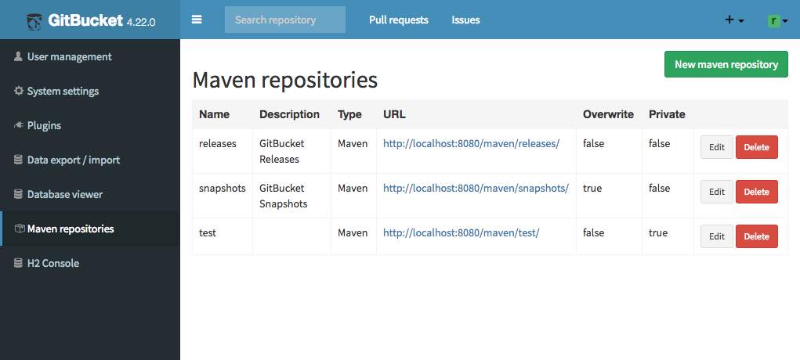

gitbucket-maven-repository-plugin [](https://github.com/takezoe/gitbucket-maven-repository-plugin/actions?query=workflow%3Abuild+branch%3Amaster)
========
A GitBucket plugin that provides Maven repository hosting on GitBucket.

## Features

In default, following Maven repositories become available by installing this plugin to GitBucket.

- `http(s)://GITBUCKET_HOST/maven/releases`
- `http(s)://GITBUCKET_HOST/maven/snapshots`

You can deploy artifacts to these repositories via WebDAV with your GitBucket account.
 
Also you can deploy via SSH (SCP) with public key authentication using keys registered in GitBucket. In this case, use following configurations to connect via SSH:

- Host: Hostname of GitBucket
- Port: SSH port configured in GitBucket system settings
- Path: `/maven/releases` or `/maven/snapshots`

It's possible to add more repositories and configure them at the administration console:



You can specify whether artifacts are overwritable for each repository. In addition, it's possible to make repository private. Private repositories require basic authentication by GitBucket account to access.

## Compatibility

Plugin version | GitBucket version
:--------------|:--------------------
1.6.x          | 4.35.x -
1.5.x          | 4.32.x -
1.4.x          | 4.30.x -
1.3.x -        | 4.23.x -
1.1.x - 1.2.x  | 4.21.x -
1.0.x          | 4.19.x -

## Installation

Download jar file from [the release page](https://github.com/takezoe/gitbucket-maven-repository-plugin/releases) and put into `GITBUCKET_HOME/plugins`.

## Build

Run `sbt assembly` and copy generated `/target/scala-2.13/gitbucket-maven-repository-plugin-x.x.x.jar` to `~/.gitbucket/plugins/` (If the directory does not exist, create it by hand before copying the jar), or just run `sbt install`.

## Configuration

### sbt

Resolvers:

```scala
resolvers ++= Seq(
 "GitBucket Snapshots Repository" at "http://localhost:8080/maven/snapshots",
 "GitBucket Releases Repository"  at "http://localhost:8080/maven/releases"
)

// If repository is private, you have to add authentication information
credentials += Credentials("GitBucket Maven Repository", "localhost", "username", "password")
```

Publish via WebDAV:

```scala
publishTo := {
  val base = "http://localhost:8080/maven/"
  if (version.value.endsWith("SNAPSHOT")) Some("snapshots" at base + "snapshots")
  else                                    Some("releases"  at base + "releases")
}

credentials += Credentials("GitBucket Maven Repository", "localhost", "username", "password")
```

Publish via SSH:

```scala
publishTo := {
  val repoInfo =
    if (version.value.endsWith("SNAPSHOT")) ("snapshots" -> "/maven/snapshots")
    else                                    ("releases"  -> "/maven/releases")
  Some(Resolver.ssh(repoInfo._1, "localhost", 29418, repoInfo._2) 
    as(System.getProperty("user.name"), (Path.userHome / ".ssh" / "id_rsa").asFile))
}
```

### Maven

Add distribution settings to your `pom.xml`:

```xml
<project>
  ...
  <distributionManagement>
    <repository>
      <id>gitbucket-maven-repository-releases</id>
      <url>http://localhost:8080/maven/releases</url>
    </repository>
    <snapshotRepository>
      <id>gitbucket-maven-repository-snapshots</id>
      <url>http://localhost:8080/maven/snapshots</url>
    </snapshotRepository>
  </distributionManagement>
  ...
</project>
```

Also you need to add authentication settings in `~/.m2/settings.xml` (replace username and password with your GitBucket account's one):

```xml
<settings>
  ...
  <servers>
    <server>
      <id>gitbucket-maven-repository-releases</id>
      <username>root</username>
      <password>root</password>
    </server>
    <server>
      <id>gitbucket-maven-repository-snapshots</id>
      <username>root</username>
      <password>root</password>
    </server>
  </servers>
   ...
</settings>
```

### Gradle

To publish your artifacts to a Maven repo hosted by **this** GitBucket plug-in, only the urls 
in your `uploadArchives.repositories` section of your `build.gradle` need to be changed (using your installation's URLs):
```groovy
// ...
def mvnUser     = hasProperty("mvnUser")     ? mvnUser     : "no_user"
def mvnPassword = hasProperty("mvnPassword") ? mvnPassword : "no_pwd" 
// ...
uploadArchives {
    repositories {
        mavenDeployer {
            repository(url:"http://localhost:8080/maven/releases") {
                authentication(userName: mvnUser, password: mvnPassword)
            }
            snapshotRepository(url: "http://localhost:8080/maven/snapshots") {
                authentication(userName: mvnUser, password: mvnPassword)
            }
    }
 }
}
// ...
```
where `mvnUser` and `mvnPassword` are set in your `~/.gradle/gradle.properties`